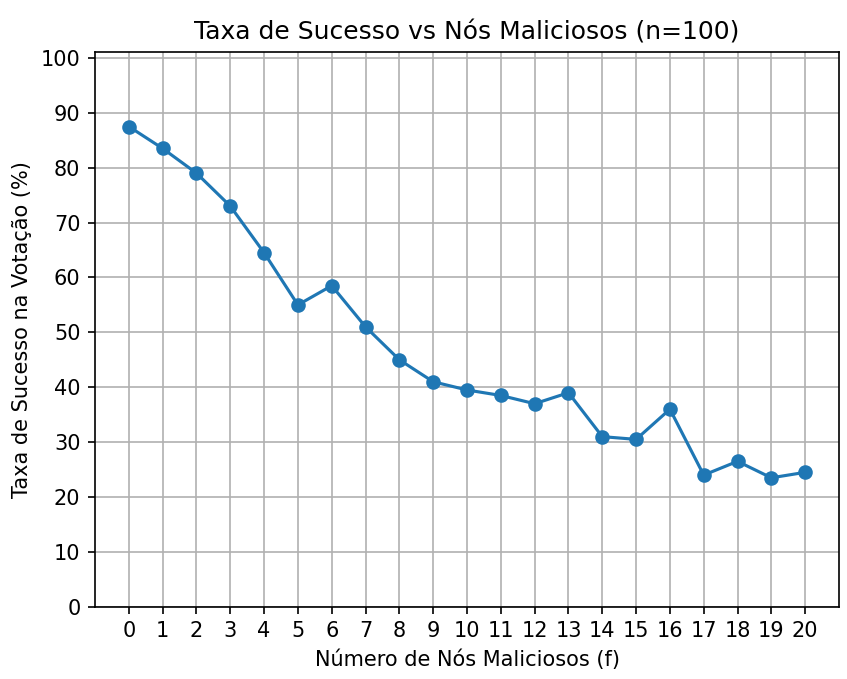

# simulacao-falha-bizantina
Simulação onde um sistema com n nós fazem uma votação, porém, existem nós maliciosos atrapalhando a votação

### A simulação consiste em:
- Nós Honestos (honest=True) definem um voto inicial aleatório (True/False) e o anunciam corretamente a todos.

- Nós Maliciosos (honest=False) enviam votos conflitantes (escolhendo aleatoriamente True ou False para cada destinatário).

- Após a fase de broadcast, cada nó honesto conta os votos recebidos + seu próprio voto e decide pela maioria.

# Exemplo com 100 nós totais

No gráfico abaixo podemos ver a simulação de 100 nós, e o impacto de 1 a 20 nós maliciosos entre os 100.

A taxa de sucesso na votação cai bruscamente conforme o número de nós maliciosos aumenta.